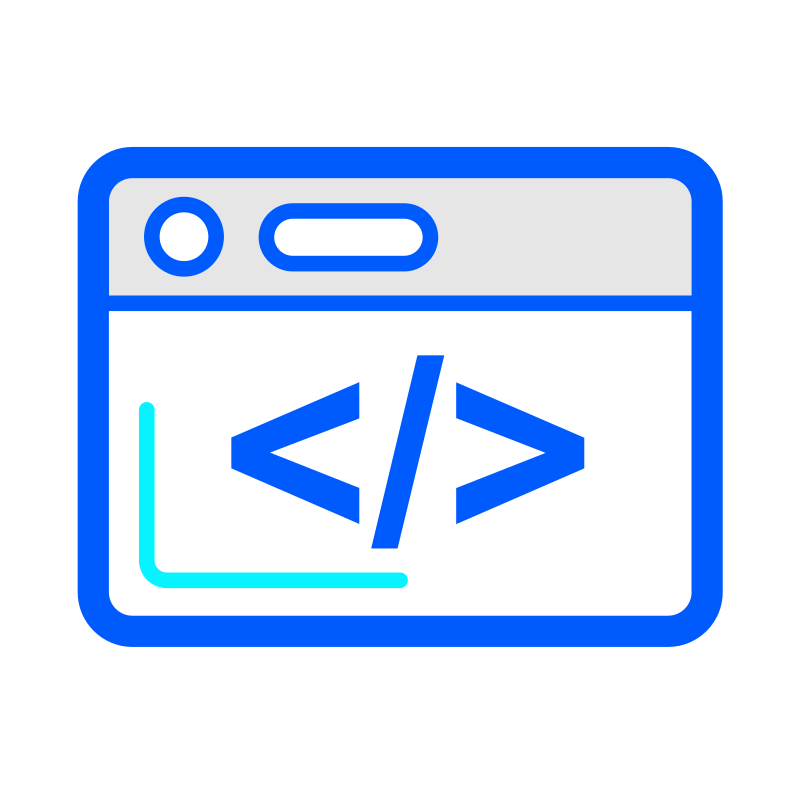
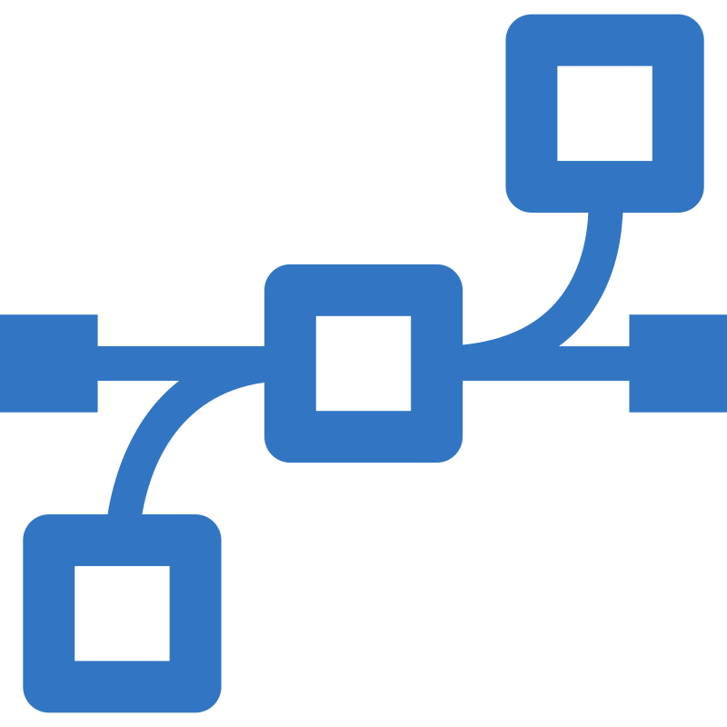
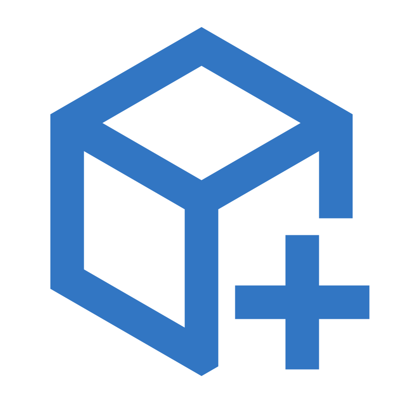
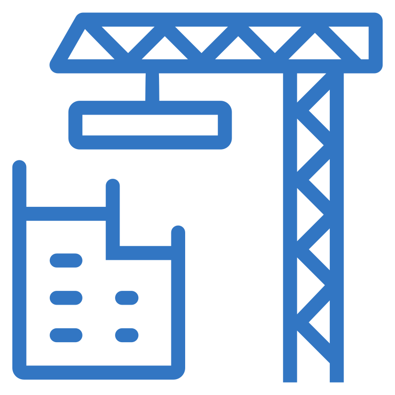
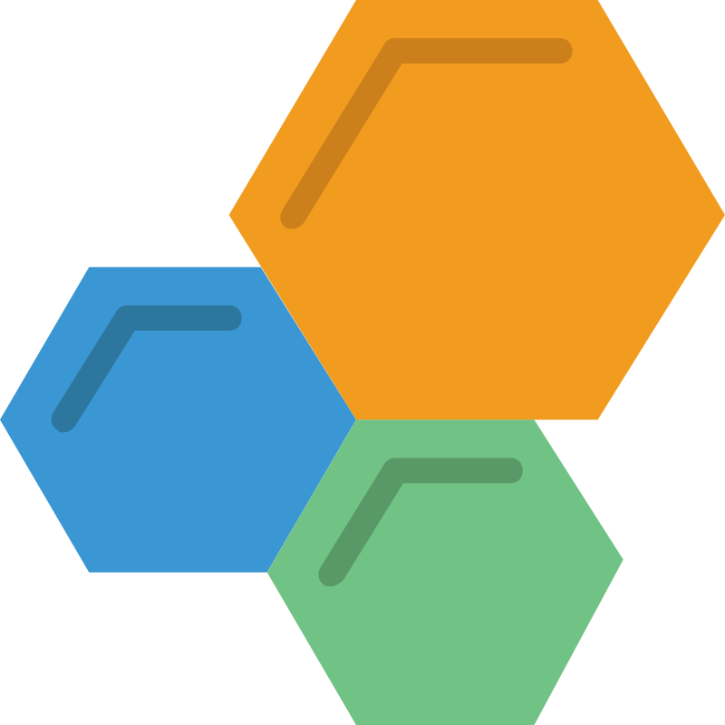

<!-- ===========================HEADER=========================== -->
<div align="center">


<br/>

[](https://git.io/typing-svg)

<br/>

[](https://github.com/Luis-For)
[](https://www.linkedin.com/in/luis-%C3%A1ngel-fornaris-rodr%C3%ADguez-2146561a2/)
[](mailto:luisfor90@gmail.com)
[](https://portafolioluisfor.vercel.app/luis-for)
[](https://wa.me/573054398894)

**Santa Marta, Magdalena, Colombia**

<br/>

<a href="#-sobre-mí">Sobre mí</a> ·
<a href="#-experiencia-laboral">Experiencia</a> ·
<a href="#-proyectos-destacados">Proyectos</a> ·
<a href="#️-arsenal-tecnológico">Stack</a> ·
<a href="#-dashboard-de-actividad">Actividad</a> ·
<a href="#-trayectoria-académica">Educación</a> ·
<a href="#-formación-continua">Cursos</a> ·
<a href="#-hablemos">Contacto</a>

</div>


<div align="center">

*"El buen código no solo funciona: se entiende, se mantiene y perdura."*

</div>

<!-- ===========================SOBRE MI=========================== -->

##  Sobre mí


<table>
<tr>
<td width="60%" valign="top">

```bash
$ > cat sobre_mi.txt

Desarrollador de Software Full Stack con experiencia en el
diseño, desarrollo e implementación de aplicaciones
empresariales, soluciones web y arquitecturas distribuidas.

He participado en la construcción de plataformas corporativas,
desarrollo de APIs, aplicaciones móviles y librerías reutilizables
utilizando tecnologías modernas como Java, Spring Boot, React, Laravel
Next.js, React Native y Node.js.

Me caracterizo por la capacidad de adaptación, el aprendizaje
continuo y la aplicación de buenas prácticas de ingeniería de
software orientadas a la calidad, mantenibilidad y escalabilidad.

$ >_
```

</td>
<td width="40%" valign="top">

  **Actualmente**

   Trabajé en el Desarrollo de Software en **Banasan**

  
  En construcción es un proyecto <strong>Full Stack</strong>, orientado a la <strong>identificación taxonómica de organismos</strong> mediante un sistema interactivo de preguntas y clasificación, buscando facilitar la identificación de especímenes y la exploración de su <strong>jerarquía</strong>
  
  </br>
  
  Profundizando en arquitecturas de microservicios  
  
  </br>
  
  Abierto a nuevas oportunidades y retos técnicos

**Idiomas**


</td>
</tr>
</table>

<br/>

##  Experiencia Laboral

 **Desarrollo de Software — Banasan**


Participación activa en el **análisis, diseño y desarrollo de SIAL**, una plataforma corporativa orientada a centralizar y digitalizar procesos internos de la organización, abordando necesidades relacionadas con la gestión de información, automatización, trazabilidad y control de los procesos.

<details>

<summary><b>Ver responsabilidades, proyectos y logros</b></summary>

<br/>

**<b>SIAL — Plataforma corporativa</b>**

* Participación en el **levantamiento, investigación y análisis de requerimientos** junto a las áreas involucradas, comprendiendo los procesos reales del negocio y transformando sus necesidades en soluciones técnicas.
* Participación en la **definición de arquitecturas y reglas de desarrollo** para aplicaciones web, móviles y servicios backend, buscando establecer una base mantenible y escalable para la plataforma.
* Desarrollo de funcionalidades para aplicaciones web y móviles utilizando **Next.js, React, React Native y TypeScript**, participando en módulos de gestión de usuarios, roles, contenedores y fincas.
* Diseño e implementación de un sistema de **enrutamiento y autorización basado en recursos, enlaces y roles**, proporcionando flexibilidad en la configuración de permisos y control sobre las operaciones.
* Implementación de mecanismos de **auditoría y trazabilidad**, permitiendo registrar y controlar las operaciones realizadas dentro de la plataforma.
* Diseño e implementación de comunicación entre servicios mediante **gRPC y Protocol Buffers**, buscando mejorar el rendimiento y la confiabilidad en entornos productivos con conectividad limitada o intermitente.

**<b>BanasanUI — Librería corporativa de componentes</b>**

* **Liderazgo técnico en la construcción de la primera versión de BanasanUI**, una librería corporativa de componentes reutilizables para **React, Next.js y React Native**, desarrollada para reducir la dependencia de soluciones externas y aumentar el control sobre los componentes utilizados.
* Diseño de una arquitectura híbrida basada en **Headless UI, Atomic Design y Platform Split**, separando lógica y presentación para favorecer la reutilización entre plataformas.
* Participación en la **refactorización y evolución de la librería**, aplicando principios de **Clean Code, modularidad, tipado estricto y mantenibilidad**.
* Implementación de **Verdaccio como registro privado de paquetes**, permitiendo distribuir y mantener las versiones de la librería dentro de la organización.
* Elaboración de documentación y participación en **sesiones de transferencia de conocimiento**, facilitando la adopción y continuidad de la solución.

**<b>Proceso y prácticas de desarrollo</b>**

* Gestión del desarrollo mediante **Scrum y Azure DevOps**, participando en planificación, definición y seguimiento de tareas, priorización técnica y evolución incremental del producto.
* Participación en un flujo basado en **Git, Pull Requests, revisión de código, pruebas, CI/CD y ambientes Development → QA → Production**, estableciendo controles de calidad antes de los despliegues.
* Uso de **Docker y Bruno** para apoyar el desarrollo y las pruebas de las soluciones.
* Participación en **toma de decisiones técnicas, documentación, sesiones técnicas y transferencia de conocimiento**, contribuyendo a la continuidad y evolución del proyecto.

**<b>Principales aportes</b>**

* Construcción y evolución de la primera versión de **BanasanUI**, posteriormente utilizada como base para el desarrollo de aplicaciones de la organización.
* Participación en la definición de **arquitecturas, reglas de desarrollo y soluciones técnicas** para un ecosistema de aplicaciones web, móviles y servicios.
* Implementación de mecanismos de **autorización, auditoría y trazabilidad** orientados a mejorar el control de las operaciones.
* Aplicación de **gRPC y Protocol Buffers** para resolver necesidades de comunicación entre servicios en condiciones de conectividad limitada.

</details>


---

 **SIBIO — Sistema Inteligente para la Biodiversidad**


Desarrollo de un sistema **Full Stack orientado a la identificación y exploración de organismos mediante información taxonómica y un proceso interactivo de preguntas**, buscando facilitar la comprensión y consulta de información sobre biodiversidad.

<details>

<summary><b>Ver responsabilidades, arquitectura y avances</b></summary>

<br/>

**<b>Investigación y definición del sistema</b>**

* Investigación y **levantamiento de requerimientos** para comprender el problema, los procesos de identificación y las necesidades de los usuarios.
* Modelado del dominio biológico y diseño de una estructura taxonómica jerárquica para representar las relaciones entre los diferentes niveles de clasificación.
* Definición progresiva de funcionalidades y flujos de usuario a partir del análisis del problema y del dominio.

**<b>Backend y arquitectura</b>**

* Diseño y desarrollo del backend utilizando **NestJS y TypeScript**, aplicando principios de **Domain-Driven Design (DDD) y Arquitectura Hexagonal**.
* Diseño de una arquitectura modular orientada a separar **dominio, aplicación e infraestructura**, facilitando la evolución y mantenimiento del sistema.
* Implementación de **autenticación y gestión de sesiones mediante JWT**, utilizando access tokens y refresh tokens.
* Diseño de la persistencia con **PostgreSQL y Prisma**, utilizando esquemas independientes para separar responsabilidades dentro de la base de datos.
* Implementación de mecanismos de **auditoría y trazabilidad** como base para el control de operaciones relevantes del sistema.

**<b>Escalabilidad y evolución</b>**

* Diseño de una base arquitectónica preparada para incorporar posteriormente **servicios especializados de identificación inteligente, procesamiento de información biológica y comunicación entre servicios**.
* Uso de **Docker** para estandarizar el entorno de desarrollo y facilitar la ejecución de los servicios.
* Organización del desarrollo mediante **Git, Scrum y sprints**, permitiendo evolucionar el sistema progresivamente a partir de las necesidades identificadas.

**<b>Objetivo del proyecto</b>**

* Construir una plataforma que no se limite a almacenar información taxonómica, sino que permita **guiar al usuario durante el proceso de identificación de un organismo**, utilizando la información del dominio como base para generar una experiencia de clasificación interactiva.

</details>

**Tecnologías:** TypeScript · NestJS · PostgreSQL · Prisma · Docker · JWT · REST API · DDD · Arquitectura Hexagonal · Git · Scrum


---

<br/>

## 🚀 Proyectos Destacados


<div align="center">

</div>

<br/>

| Proyecto | Descripción | Stack | Estado |
| :-- | :-- | :-- | :-- |
| **SIBIO** | Sistema inteligente para la biodiversidad: identificación taxonómica interactiva de organismos. | ![Next.js][tech-next] ![TypeScript][tech-ts] ![Prisma][tech-prisma] ![PostgreSQL][tech-postgres] ![Android][tech-android] | ![En construcción][estado-construccion] |
| **[Taxokey][repo-taxokey]** | Plataforma web para identificación de organismos basada en claves taxonómicas, diseñada para taxónomos y estudiantes. | ![Java][tech-java] ![Spring Boot][tech-spring] ![React][tech-react] ![PostgreSQL][tech-postgres] | ![En progreso][estado-progreso] |
| **[API de Microservicios][repo-microservicios]** | Microservicios con Java y Spring Boot: API Gateway, monitoreo con Grafana/Prometheus y despliegue con Docker. | ![Java][tech-java] ![Spring Boot][tech-spring] ![Docker][tech-docker] ![Grafana][tech-grafana] ![Prometheus][tech-prometheus] | ![En progreso][estado-progreso] |
| **[Big Data - Análisis Estadístico][repo-bigdata]** | Uso de SQL, Python y motores Big Data para análisis avanzado de datos agrícolas. | ![SQL][tech-sql] ![Python][tech-python] | ![En progreso][estado-progreso] |
| **[DB Postgres - Clasificación de Animales][repo-db-animales]** | Base de datos relacional con análisis en Python para clasificación mediante claves taxonómicas. | ![PostgreSQL][tech-postgres] ![Python][tech-python] | ![En progreso][estado-progreso] |
| **[API REST de Fútbol][repo-futbol]** | Backend y frontend con Spring Boot y React para gestión de datos de futbolistas y partidos. | ![Spring Boot][tech-spring] ![React][tech-react] | ![Terminado][estado-terminado] |

<!-- Estado -->
[estado-construccion]: https://img.shields.io/badge/En_construcci%C3%B3n-F59E0B?style=flat-square
[estado-progreso]: https://img.shields.io/badge/En_progreso-339AF0?style=flat-square
[estado-terminado]: https://img.shields.io/badge/Terminado_%28actualizando%29-2ECC71?style=flat-square

<!-- Stack -->
[tech-java]: https://img.shields.io/badge/Java-6366F1?style=flat-square&logo=openjdk&logoColor=white
[tech-spring]: https://img.shields.io/badge/Spring_Boot-6366F1?style=flat-square&logo=springboot&logoColor=white
[tech-react]: https://img.shields.io/badge/React-6366F1?style=flat-square&logo=react&logoColor=white
[tech-next]: https://img.shields.io/badge/Next.js-6366F1?style=flat-square&logo=nextdotjs&logoColor=white
[tech-ts]: https://img.shields.io/badge/TypeScript-6366F1?style=flat-square&logo=typescript&logoColor=white
[tech-prisma]: https://img.shields.io/badge/Prisma-6366F1?style=flat-square&logo=prisma&logoColor=white
[tech-postgres]: https://img.shields.io/badge/PostgreSQL-6366F1?style=flat-square&logo=postgresql&logoColor=white
[tech-python]: https://img.shields.io/badge/Python-6366F1?style=flat-square&logo=python&logoColor=white
[tech-sql]: https://img.shields.io/badge/SQL-6366F1?style=flat-square
[tech-docker]: https://img.shields.io/badge/Docker-6366F1?style=flat-square&logo=docker&logoColor=white
[tech-grafana]: https://img.shields.io/badge/Grafana-6366F1?style=flat-square&logo=grafana&logoColor=white
[tech-prometheus]: https://img.shields.io/badge/Prometheus-6366F1?style=flat-square&logo=prometheus&logoColor=white
[tech-android]: https://img.shields.io/badge/Android-6366F1?style=flat-square&logo=android&logoColor=white

<!-- Repositorios -->
[repo-taxokey]: https://github.com/Luis-For/MorphoKey-ui-backend
[repo-microservicios]: https://gitfront.io/r/Luis-For/qd7ZDe3eLEbD/microservicios-spring/
[repo-bigdata]: https://github.com/Luis-For/BigDatatTest
[repo-db-animales]: https://github.com/Luis-For/DataBaseFootball
[repo-futbol]: https://github.com/Luis-For/Api-futbol

<br/>

## 🛠️ Arsenal Tecnológico


<table>
<tr>
<td valign="top" width="25%">

**Backend**
<br/><br/>
<a href="https://skillicons.dev"></a>

`Java`      ▰▰▰▰▰  
`Spring`    ▰▰▰▰▰  
`Node.js`   ▰▰▰▰▱  
`NestJS`    ▰▰▰▰▱  
`Laravel`   ▰▰▰▰▱  

</td>
<td valign="top" width="25%">

**Frontend & Mobile**
<br/><br/>
<a href="https://skillicons.dev"></a>

`React/Next` ▰▰▰▰▱  
`TypeScript` ▰▰▰▰▱  
`React Native` ▰▰▰▱▱  
`Angular/Vue` ▰▰▰▰▱  

</td>
<td valign="top" width="25%">

**Datos & Infra**
<br/><br/>
<a href="https://skillicons.dev"></a>

`PostgreSQL` ▰▰▰▰▱
`MongoDB`    ▰▰▰▱▱
`Redis`      ▰▰▰▱▱
`Docker`     ▰▰▰▰▱

</td>
<td valign="top" width="25%">

**Herramientas**
<br/><br/>
<a href="https://skillicons.dev"></a>

`Git`        ▰▰▰▰▰
`Azure DevOps` ▰▰▰▱▱
`Grafana`    ▰▰▰▱▱
`JWT/Auth`   ▰▰▰▰▱

</td>
</tr>
</table>

<br/>
<!-- ===========================ACTIVIDAD GIT=========================== -->

##   Dashboard de Actividad


<div align="center">


<br/>

</div>

> 💡 Actividad real.

<div align="center">


</div>

<br/>

<!-- ===========================FORMACION CONTINUA=========================== -->

### Formación continua


<table>
<tr>
<td valign="top" width="50%">


`Ingeniero de sistemas`

<sub>Titulo actual como Ingeniero de sistemas de la Universidad del Magdalena.</sub>

</td>
<td valign="top" width="50%">


**Java de Cero a Profesional**<br/>
<sub>POO, manejo de excepciones, HTTP y archivos.</sub>

**Ciencia de Datos con Python**<br/>
<sub>Python desde básico hasta avanzado.</sub>

</td>
</tr>
<tr>
<td valign="top">


**Curso de Spring Boot**<br/>
<sub>Controladores avanzados, gestión de archivos BLOB y diseño de APIs REST escalables.</sub>

**Curso de React Native**

</td>
<td valign="top">


**Técnico en Diseño e Integración Multimedia** · 2020<br/>
**Técnico en Asistente Administrativo** · 2019<br/>
**Servicio al Cliente** · 2019

<sub>Formación técnica complementaria.</sub>

</td>
</tr>
<tr>
<td valign="top" width="50%">


`Git` `Docker` `Spring Boot` `Big Data`

<sub>Certificaciones prácticas orientadas a proyectos reales.</sub>

</td>
</tr>
</table>

<br/>

## 📬 Hablemos


<div align="center">

Estoy abierto a colaboraciones, nuevas oportunidades y proyectos desafiantes que me permitan aprender, mejorar y aportar valor con las nuevas tecnologías.

[](https://www.linkedin.com/in/luis-%C3%A1ngel-fornaris-rodr%C3%ADguez-2146561a2/)
[](mailto:luisfor90@gmail.com)
[](https://mi-portafolio-web-one.vercel.app/)
[](https://wa.me/573054398894)

<br/>

<!-- ===========================FOOTER=========================== -->

Muchas gracias por visitar mi perfil.

[](https://git.io/typing-svg)

</div>

