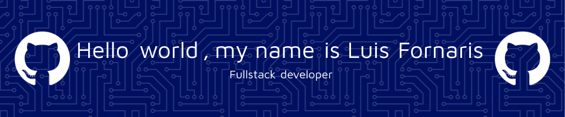

<div align="center">




<br/>

[](https://git.io/typing-svg)

<br/>

[](https://github.com/Luis-For)
[](https://www.linkedin.com/in/luis-%C3%A1ngel-fornaris-rodr%C3%ADguez-2146561a2/)
[](mailto:luisfor90@gmail.com)
[](https://mi-portafolio-web-one.vercel.app/)
[](https://wa.me/573054398894)

📍 **Santa Marta, Magdalena, Colombia**

<br/>

<a href="#-sobre-mí">Sobre mí</a> ·
<a href="#-experiencia-laboral">Experiencia</a> ·
<a href="#-proyectos-destacados">Proyectos</a> ·
<a href="#️-arsenal-tecnológico">Stack</a> ·
<a href="#-dashboard-de-actividad">Actividad</a> ·
<a href="#-trayectoria-académica">Educación</a> ·
<a href="#-formación-continua">Cursos</a> ·
<a href="#-hablemos">Contacto</a>

</div>


<div align="center">

*"El buen código no solo funciona: se entiende, se mantiene y perdura."*

</div>

## 🧠 Sobre mí


<table>
<tr>
<td width="60%" valign="top">

```bash
$ cat sobre_mi.txt

Desarrollador de Software Full Stack con experiencia en el
diseño, desarrollo e implementación de aplicaciones
empresariales, soluciones web y arquitecturas distribuidas.

He participado en la construcción de plataformas corporativas,
desarrollo de APIs, aplicaciones móviles y librerías reutilizables
utilizando tecnologías modernas como Java, Spring Boot, React,
Next.js, React Native y Node.js.

Me caracterizo por la capacidad de adaptación, el aprendizaje
continuo y la aplicación de buenas prácticas de ingeniería de
software orientadas a la calidad, mantenibilidad y escalabilidad.

$ _
```

</td>
<td width="40%" valign="top">

**📌 Ahora mismo**

🔭 Practicante de Desarrollo de Software en **Banasan**
🚧 Construyendo un proyecto full stack **Web + App Android + Backend** (próximamente más detalles 👀)
📚 Profundizando en arquitecturas de microservicios
💬 Abierto a nuevas oportunidades y retos técnicos

**🌐 Idiomas**


</td>
</tr>
</table>

<br/>

## 💼 Experiencia Laboral


<table>
<tr>
<td align="center" width="36">🟣</td>
<td width="230"></td>
<td>

**🏢 Practicante de Desarrollo de Software — Banasan**

Participación activa en el análisis, diseño y desarrollo de **SIAL**, una plataforma corporativa orientada a la centralización y gestión de los procesos internos de la organización.

<details>
<summary><b>Ver responsabilidades, proyectos y logros</b></summary>
<br/>

**📋 SIAL — Plataforma corporativa**
- Participación en el levantamiento y análisis de requerimientos funcionales y técnicos junto a las áreas involucradas en el proyecto.
- Colaboración en la definición de la arquitectura tecnológica para aplicaciones web y móviles, con un enfoque basado en **Feature-Based Architecture** adaptado a las necesidades del negocio.
- Desarrollo de funcionalidades para plataformas web y móviles utilizando **Next.js, React Native, TypeScript** y tecnologías asociadas.
- Diseño e implementación de módulos para la gestión de usuarios, roles, contenedores y fincas, garantizando la administración y control eficiente de la información.

**⚙️ Arquitectura de Microservicios**
- Diseño e implementación de una arquitectura basada en microservicios utilizando **Java, Spring Boot y Spring Cloud**.
- Desarrollo de servicios independientes para gestión de productos, inventario, órdenes y pagos, aplicando principios de escalabilidad y desacoplamiento.
- Implementación de **Service Discovery, API Gateway**, monitoreo con **Grafana y Prometheus**, e integración de **PostgreSQL, MongoDB y Redis**.
- Contenerización y despliegue del entorno mediante **Docker y Docker Compose**.

**🧩 BanasanUI — Librería corporativa de componentes**
- Liderazgo técnico en la construcción de la primera versión de **BanasanUI**, una librería corporativa de componentes reutilizables para **React, Next.js y React Native**.
- Implementación de una arquitectura híbrida basada en los principios **Headless UI, Atomic Design y Platform Split** para maximizar la reutilización y mantenibilidad del código.
- Participación en procesos de refactorización y evolución de la librería, contribuyendo a su crecimiento hasta versiones posteriores de producción.
- Aplicación de principios de **Clean Code**, buenas prácticas de desarrollo, modularidad y escalabilidad.
- Gestión del ciclo de desarrollo utilizando **Azure DevOps, Git, Docker y Bruno** para pruebas e integración de servicios.
- Participación continua en la planificación técnica, definición de tareas y toma de decisiones relacionadas con el desarrollo del producto.

**🏆 Logros**
- Creación de la primera versión de una librería corporativa de componentes reutilizables para React, Next.js y React Native.
- Diseño e implementación de arquitecturas basadas en microservicios utilizando Spring Cloud.
- Desarrollo de aplicaciones Full Stack aplicando Arquitectura Hexagonal y principios SOLID.
- Participación en la definición técnica y construcción de una plataforma empresarial desde etapas iniciales.

</details>

</td>
</tr>
<tr>
<td align="center">┃</td>
<td colspan="2"></td>
</tr>
<tr>
<td align="center">🔵</td>
<td></td>
<td>

**🧬 Desarrollador Full Stack Freelance — Taxokey**

Desarrollo de una aplicación web orientada a la identificación y clasificación de especies mediante claves taxonómicas.

<details>
<summary><b>Ver responsabilidades y logros</b></summary>
<br/>

- Diseño y modelado de bases de datos utilizando **PostgreSQL**.
- Desarrollo backend con **Java y Spring Boot** bajo **Arquitectura Hexagonal**.
- Implementación de autenticación y autorización mediante **JWT**.
- Construcción de APIs REST para la gestión de especies y clasificaciones taxonómicas.
- Desarrollo frontend utilizando **React y Tailwind CSS**.
- Integración completa entre frontend y backend garantizando rendimiento y mantenibilidad.

</details>

</td>
</tr>
</table>

<br/>

## 🚀 Proyectos Destacados


<div align="center">

<a href="https://github.com/Luis-For/MorphoKey-ui-backend"></a>
<a href="https://github.com/Luis-For/Api-futbol"></a>
<a href="https://github.com/Luis-For/BigDatatTest"></a>
<a href="https://github.com/Luis-For/DataBaseFootball"></a>

</div>

<br/>

<table>
  <tr>
    <th align="left">Proyecto</th>
    <th align="left">Descripción</th>
    <th align="left">Stack</th>
    <th align="left">Estado</th>
  </tr>
  <tr>
    <td>🧬 <b><a href="https://github.com/Luis-For/MorphoKey-ui-backend">Taxokey</a></b></td>
    <td>Plataforma web para identificación de organismos basada en claves taxonómicas, diseñada para taxónomos y estudiantes.</td>
    <td></td>
    <td></td>
  </tr>
  <tr>
    <td>⚙️ <b><a href="https://gitfront.io/r/Luis-For/qd7ZDe3eLEbD/microservicios-spring/">API de Microservicios</a></b></td>
    <td>Microservicios con Java y Spring Boot: API Gateway, monitoreo con Grafana/Prometheus y despliegue con Docker.</td>
    <td></td>
    <td></td>
  </tr>
  <tr>
    <td>📊 <b><a href="https://github.com/Luis-For/BigDatatTest">Big Data - Análisis Estadístico</a></b></td>
    <td>Uso de SQL, Python y motores Big Data para análisis avanzado de datos agrícolas.</td>
    <td></td>
    <td></td>
  </tr>
  <tr>
    <td>🗄️ <b><a href="https://github.com/Luis-For/DataBaseFootball">DB Postgres - Clasificación de Animales</a></b></td>
    <td>Base de datos relacional con análisis en Python para clasificación mediante claves taxonómicas.</td>
    <td></td>
    <td></td>
  </tr>
  <tr>
    <td>⚽ <b><a href="https://github.com/Luis-For/Api-futbol">API REST de Fútbol</a></b></td>
    <td>Backend y frontend con Spring Boot y React para gestión de datos de futbolistas y partidos.</td>
    <td></td>
    <td></td>
  </tr>
  <tr>
    <td>🚧 <b>SIBIO – Sistema Inteligente para la Biodiversidad</b></td>
    <td><i>➜ Proyecto en construcción.</i></td>
    <td>
      
      
      
    </td>
    <td></td>
  </tr>
</table>

<br/>

## 🛠️ Arsenal Tecnológico


<table>
<tr>
<td valign="top" width="25%">

**Backend**
<br/><br/>
<a href="https://skillicons.dev"></a>

`Java`      ▰▰▰▰▰
`Spring`    ▰▰▰▰▰
`Node.js`   ▰▰▰▰▱
`NestJS`    ▰▰▰▱▱

</td>
<td valign="top" width="25%">

**Frontend & Mobile**
<br/><br/>
<a href="https://skillicons.dev"></a>

`React/Next` ▰▰▰▰▱
`TypeScript` ▰▰▰▰▱
`React Native` ▰▰▰▱▱
`Angular/Vue` ▰▰▰▰▱

</td>
<td valign="top" width="25%">

**Datos & Infra**
<br/><br/>
<a href="https://skillicons.dev"></a>

`PostgreSQL` ▰▰▰▰▱
`MongoDB`    ▰▰▰▱▱
`Redis`      ▰▰▰▱▱
`Docker`     ▰▰▰▰▱

</td>
<td valign="top" width="25%">

**Herramientas**
<br/><br/>
<a href="https://skillicons.dev"></a>

`Git`        ▰▰▰▰▰
`Azure DevOps` ▰▰▰▱▱
`Grafana`    ▰▰▰▱▱
`JWT/Auth`   ▰▰▰▰▱

</td>
</tr>
</table>

<br/>

## 📈 Dashboard de Actividad


<div align="center">


<br/>

</div>

> 💡 Actividad real.

<div align="center">


</div>

<br/>

## 🎓 Trayectoria Académica


<table>
<tr>
<td align="center" width="36">🟣</td>
<td width="150"></td>
<td>

**🎓 Ingeniería de Sistemas**
<br/>Universidad del Magdalena
<br/><sub>Participación activa en proyectos de investigación y desarrollo académico.</sub>

</td>
</tr>
<tr>
<td align="center">┃</td>
<td colspan="2"></td>
</tr>
<tr>
<td align="center">🔵</td>
<td></td>
<td>

**🏫 Bachiller Administrativo**
<br/><sub>I.E.D. Aluna Fe y Alegría</sub>

</td>
</tr>
</table>

<br/>

## 📚 Formación Continua


<table>
<tr>
<td align="center" width="36">🟢</td>
<td width="150"></td>
<td>

**Git · Docker · Spring Boot · Big Data**
<br/><sub>Certificaciones prácticas orientadas a proyectos reales.</sub>

</td>
</tr>
<tr>
<td align="center">┃</td>
<td colspan="2"></td>
</tr>
<tr>
<td align="center">🔵</td>
<td></td>
<td>

**Java de Cero a Profesional · Ciencia de Datos con Python**
<br/><sub>POO, manejo de excepciones, HTTP y archivos · Python desde básico hasta avanzado.</sub>

</td>
</tr>
<tr>
<td align="center">┃</td>
<td colspan="2"></td>
</tr>
<tr>
<td align="center">🟠</td>
<td width="150"></td>
<td>

**Técnico en Diseño e Integración Multimedia** (2020) · **Técnico en Asistente Administrativo** (2019) · **Servicio al Cliente** (2019)
<br/><sub>Formación técnica complementaria.</sub>

</td>
</tr>
</table>

<div align="center">

</div>

<table>
<tr>
<td align="center" width="90">🟢</td>
<td>Curso de Spring Boot — <sub>controladores avanzados, gestión de archivos BLOB y diseño de APIs REST escalables.</sub></td>
</tr>
<tr>
<td align="center" width="90">🟢</td>
<td><i>➜ Agrega aquí tu próximo curso o ruta de Platzi</i></td>
</tr>
</table>

<sub>💡 Cuéntame qué cursos o rutas de Platzi completaste y te los dejo listados aquí con el formato correcto (con sus badges e íconos).</sub>

<br/>

## 📬 Hablemos


<div align="center">

Estoy abierto a colaboraciones, nuevas oportunidades y proyectos desafiantes que me permitan aprender, mejorar y aportar valor con las nuevas tecnologías.

[](https://www.linkedin.com/in/luis-%C3%A1ngel-fornaris-rodr%C3%ADguez-2146561a2/)
[](mailto:luisfor90@gmail.com)
[](https://mi-portafolio-web-one.vercel.app/)
[](https://wa.me/573054398894)

<br/>

Muchas gracias por visitar mi perfil.

[](https://git.io/typing-svg)

</div>

